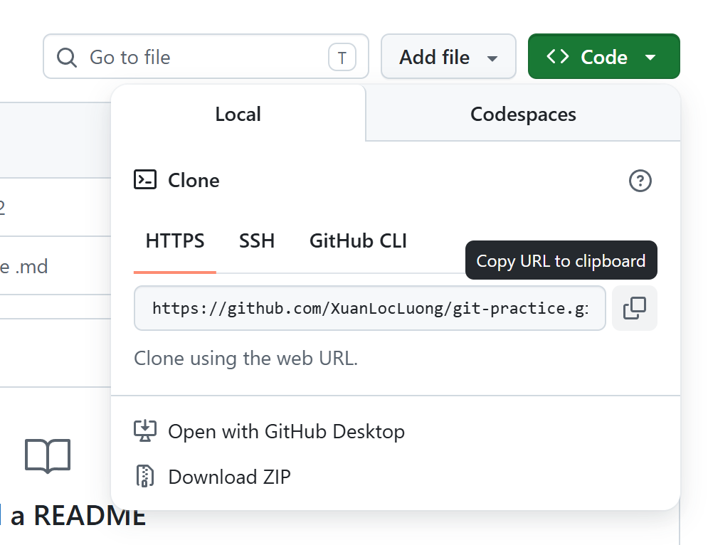
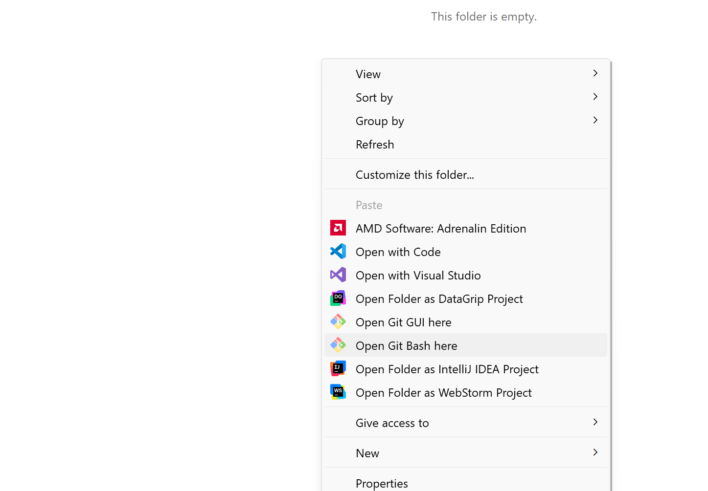

# Bai 2
## Các lệnh cơ bản của git
---
### git config
* dùng để set username và email hoặc kiểm tra username và email đã set trước đó
* Cú pháp cụ thể: 
1.`git config --global user.name` / `git config --global user.email`: kiểm tra username và email 
2.`git config --global user.name = "Tên"` / `git config --global user.email = "Email"`: set name hoặc email mới
---
### git init
* dùng để khởi tạo git cho một project tại một thư mực hiện có, có thể thao tác các lệnh git sau khi khởi tạo trong thư mục này
* Cú pháp cụ thể: `git init` tại một thư mục nào đó
---
### git clone 
* dùng để tải về 1 repo đã được tạo từ remote sourse (github, gitlab, v.v..)
* Cú pháp cụ thể: `git clone đường_link_của_remote_source`
* Clone một repo về local (Bài 4):
1.Copy đường link remote source (github, gitlab, ...): 

2.Vào một thư mục trống và open git bash tại đây:
 
3.`git clone đường_link_remote_source` , enter để tải source về:

---
### git status
* dùng để check trạng thái những file có thay đổi tính từ lần commit gần nhất
* Cú pháp cụ thể: `git status` trong thư mục cần kiểm tra

---
### git add
* Dùng để chọn các file cần lưu thay đổi cho lần commit tiếp theo
* Cú pháp cụ thể: 
`git add tên_file` nếu chỉ cần lưu thay đổi 1 file cụ thể 
`git add . ` nếu lưu thay đổi tất cả các file có thay đổi tính từ lần commit gần nhất
---
### git commit
* dùng để lưu lại version của code đến thời điểm hiện tại
* Cú pháp cụ thể:
`git commit -m "nội dung commit"` (-m là ghi chú cho lần lưu code đó)
<image src="image/b2_1.png">
---
### git push
* dùng để đẩy code từ local lên remote (github/gitlab) nếu đã add và commit các thay đổi
* Cú pháp cụ thể: `git push origin tên_nhánh_hiện_tại`
<image src="image/b2_2.png">
---
### git pull
* Dùng để update các thay đổi của nhánh hiện tại trên remote và apply các thay đổi đó vào code tại local
* Cú pháp cụ thể: `git pull origin tên_nhánh_hiện_tại`
---
### git branch
* dùng để liệt kê tất cả các branch
* Cú pháp cụ thể: 
`git branch`: kiểm tra các nhánh hiện tại ở local
<image src="image/b2_3.png">
`git branch -a`: kiểm tra tất cả các nhánh hiện tại ở cả local và remote
<image src="image/b2_4.png">
---
### git checkout
* Chuyển sang branch khác
* Cú pháp cụ thể:
`git checkout tên_nhánh` nếu đã tạo nhánh đó
`git checkout -b tên_nhánh` nếu muốn tạo và chuyển qua nhánh mới
---
### git stash
* Lưu các thay đổi hiện tại vào một ổ nhớ khác mà chưa muốn commit, sau khi lưu xong thì xoá các thay đổi đó tính từ lần commit gần nhất
VD: khi remote có cập nhật, muốn pull về mà local hiện tại đang có các thay đổi chưa commit thì cho vào đây
* Cú pháp cụ thể: 
`git stash`
<image src="image/b2_5.png">
`git stash pop`: phục hồi lại các thay đổi đó vào local
<image src="image/b2_6.png">
---
### git merge
* dùng để merge 2 nhánh lại với nhau
* Cách dùng cụ thể: 
Chuyển tới branch muốn merge vào rồi `git merge tên_nhánh_muốn_merge`
<image src="image/b2_8.png">
sau khi merge xong thì sẽ vào màn hình nhập thông điệp để tự động commit, gõ ESC và :wq enter và enter tiếp để thoát, sẽ tự động commit các merge file
---
### git reset
* dùng để bỏ git add và git commit hiện tại về commit cũ
* Cú pháp cụ thể: 
`git reset mã_commit`: trở về commit có mã commit được liệt kê trong `git log --oneline`
`git reset --hard mã_commit`: trở về commit đó và xoá các thay đổi ở các commit sau commit này
---
### git remote
* dùng để kiểm tra liên kết của local tới remote hiện tại gồm những remote nào
* Cú pháp cụ thể: `git remote`
<image src="image/b2_7.png">