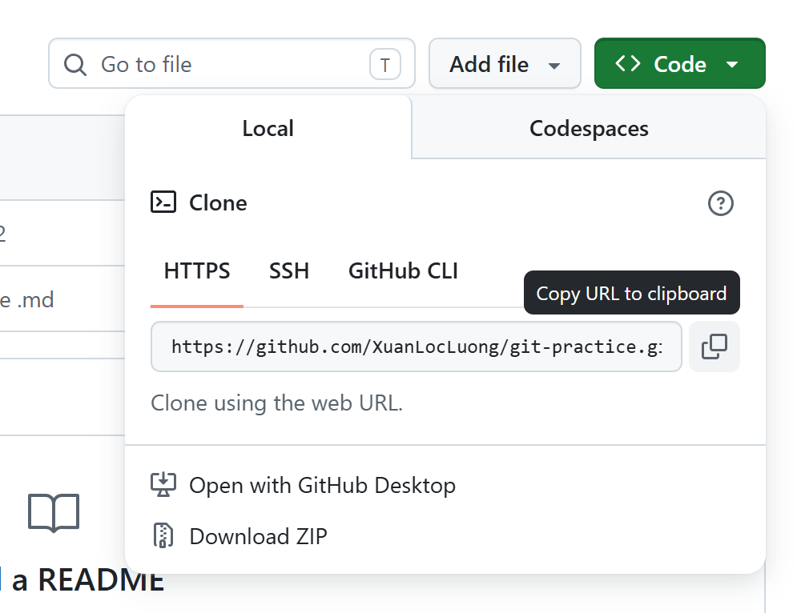
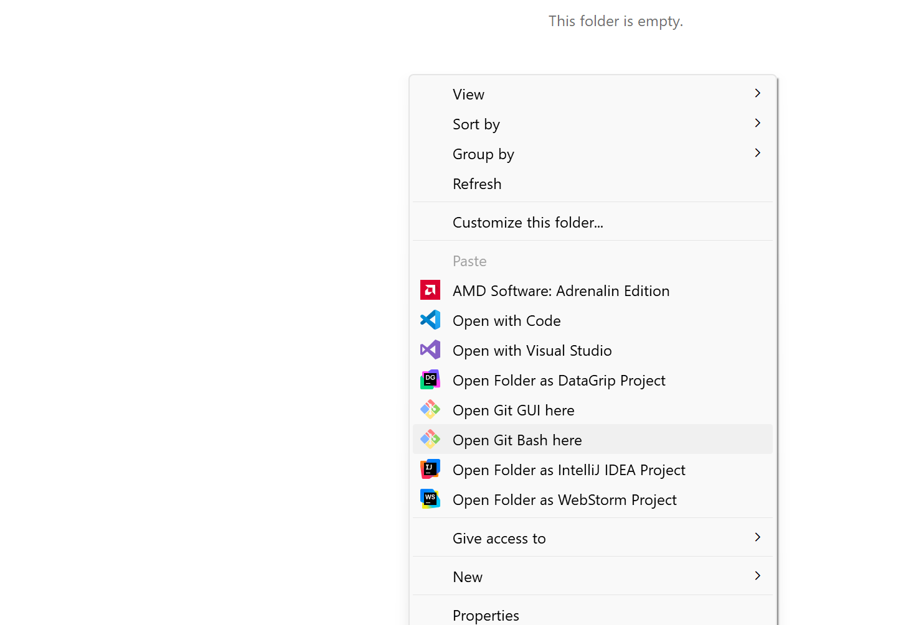
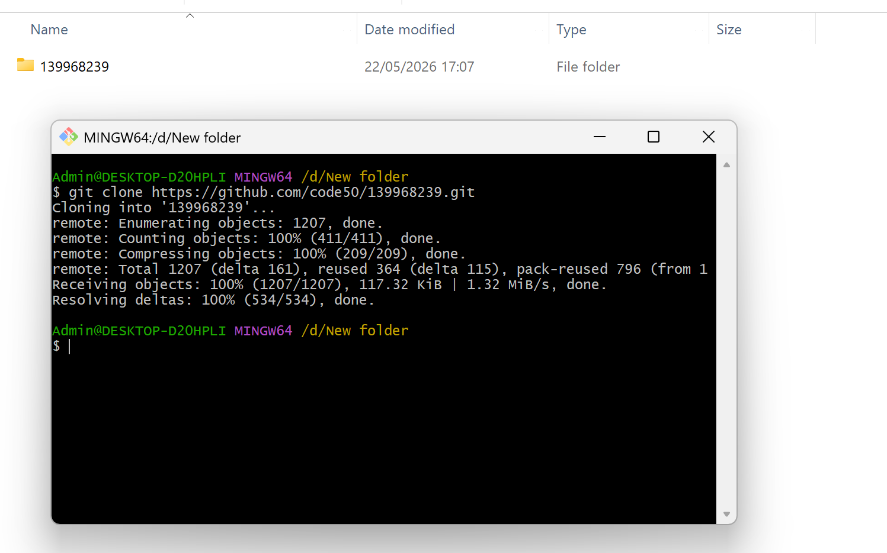
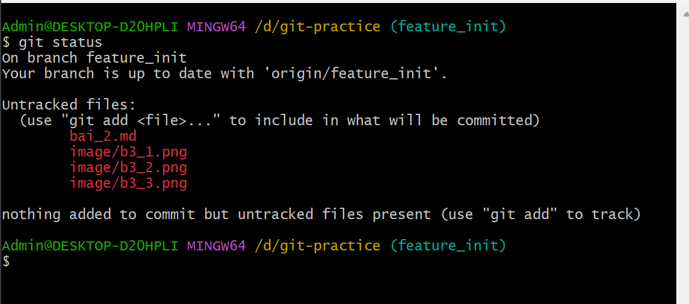

# Bai 2
## Các lệnh cơ bản của git
---
### git config
* dùng để set username và email hoặc kiểm tra username và email đã set trước đó
* Cú pháp cụ thể: 
1.`git config --global user.name` / `git config --global user.email`: kiểm tra username và email 
2.`git config --global user.name = "Tên"` / `git config --global user.email = "Email"`: set name hoặc email mới
---
### git init
* dùng để khởi tạo git cho một project tại một thư mực hiện có, có thể thao tác các lệnh git sau khi khởi tạo trong thư mục này
* Cú pháp cụ thể: `git init` tại một thư mục nào đó
---
### git clone 
* dùng để tải về 1 repo đã được tạo từ remote sourse (github, gitlab, v.v..)
* Cú pháp cụ thể: `git clone đường_link_của_remote_source`
* Clone một repo về local (Bài 3):
1.Copy đường link remote source (github, gitlab, ...): 

2.Vào một thư mục trống và open git bash tại đây:
 
3.`git clone đường_link_remote_source` , enter để tải source về:

---
### git status
* dùng để check trạng thái những file có thay đổi tính từ lần commit gần nhất
* Cú pháp cụ thể: `git status` trong thư mục cần kiểm tra

---
### git add
