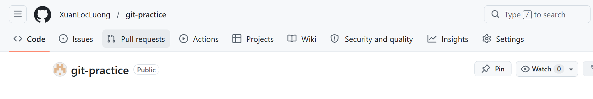
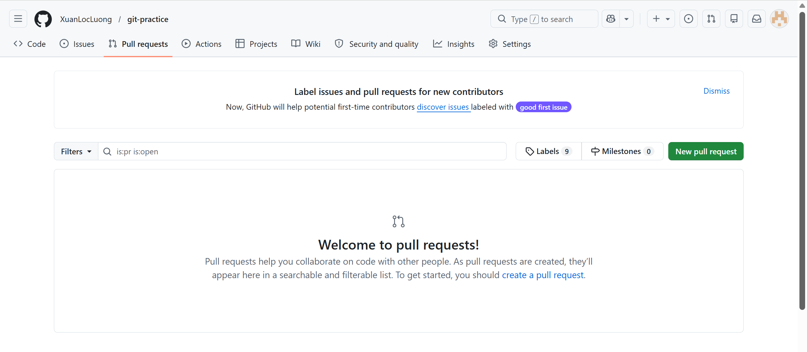
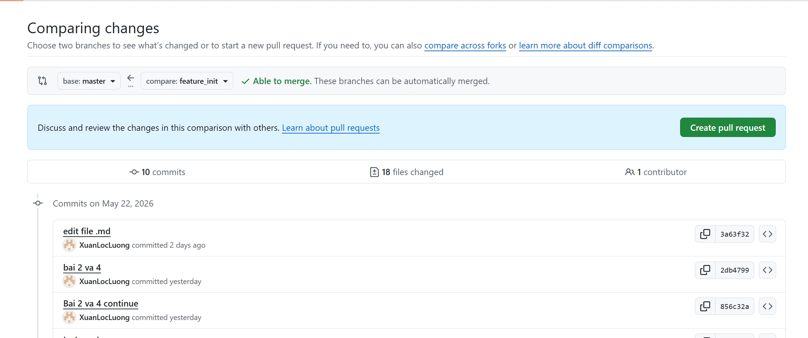
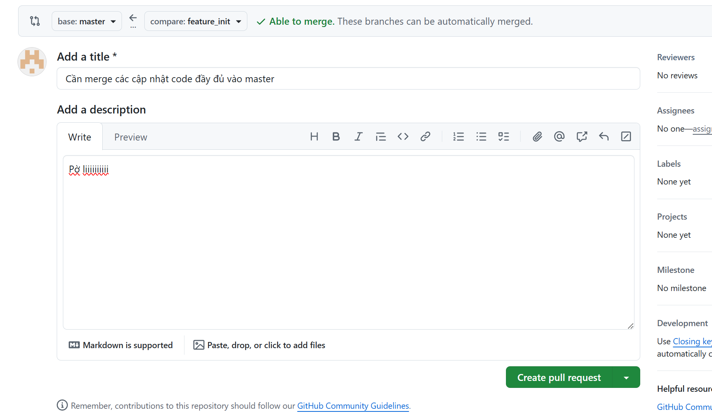
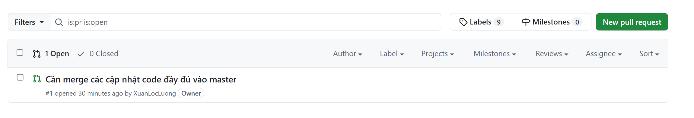
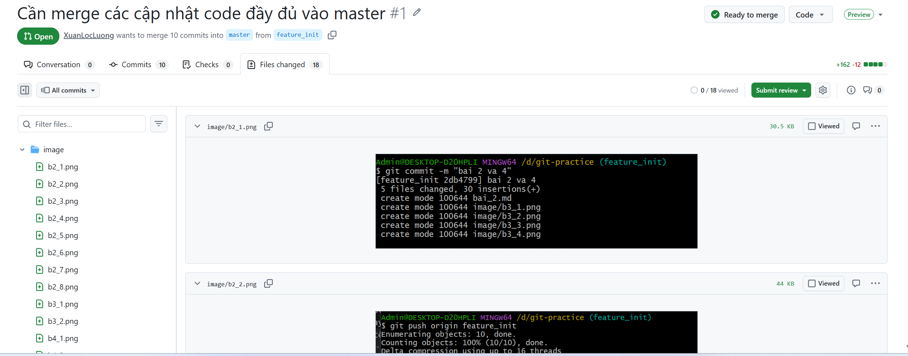
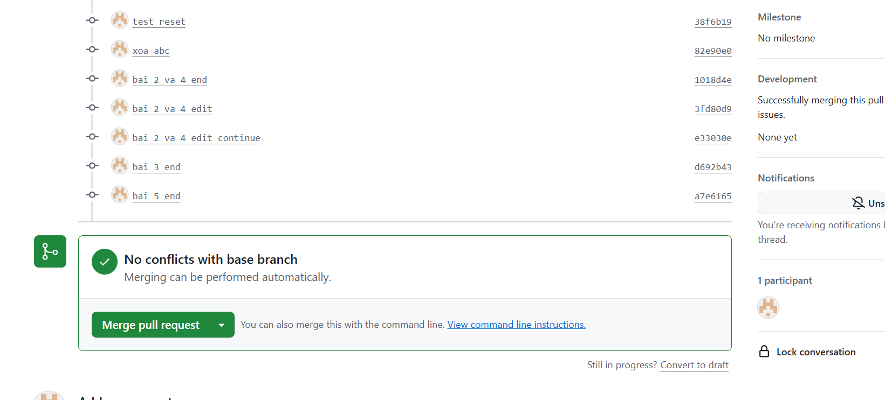
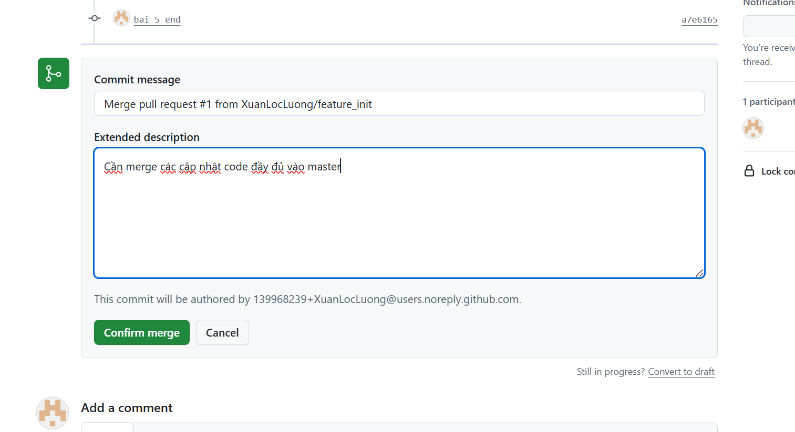

# Bài 6: Tạo pull request
---
## Các bước cụ thể
---
1. Vào repo trên github, bấm vào tab `Pull requests` ở thanh công cụ phía trên

2. Bấm vào `New pull requests`

3. Ở màn hình `Compare changes`, cần chọn đúng hướng đi của code:
* base: nhánh nhận code (ở hình ảnh là master)
* compare: nhánh chưa code mới đi cho code (ở hình ảnh là feature_init)

4. Sau khi chọn xong, nếu code hai bên ổn để có thể merge, github sẽ hiện lên dòng chữ xanh lá `Able to merge` và hiển thị nút `Create pull request`. Bấm vào đó

5. Gõ Tiêu đề và Mô tả, rồi bấm Create pull request lần nữa để nộp đơn.

6. Với vai trò là lead hoặc bên quản lý code sẽ bắt đầu kiểm tra request, mở ra và kiểm tra (1 hình ảnh)

7. Kiểm tra code, trong tab file changes 

8. Chấp nhận gộp code nếu code ổn, bấm `merge pull request` -> điền commit message và extended description nếu cần -> `confirm merge` (2 ảnh)

